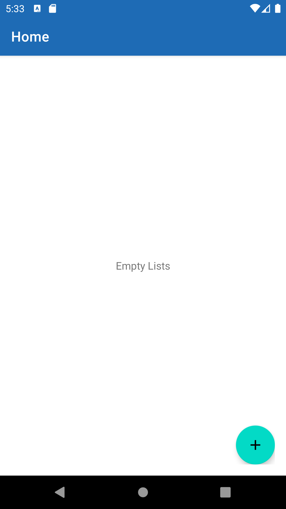
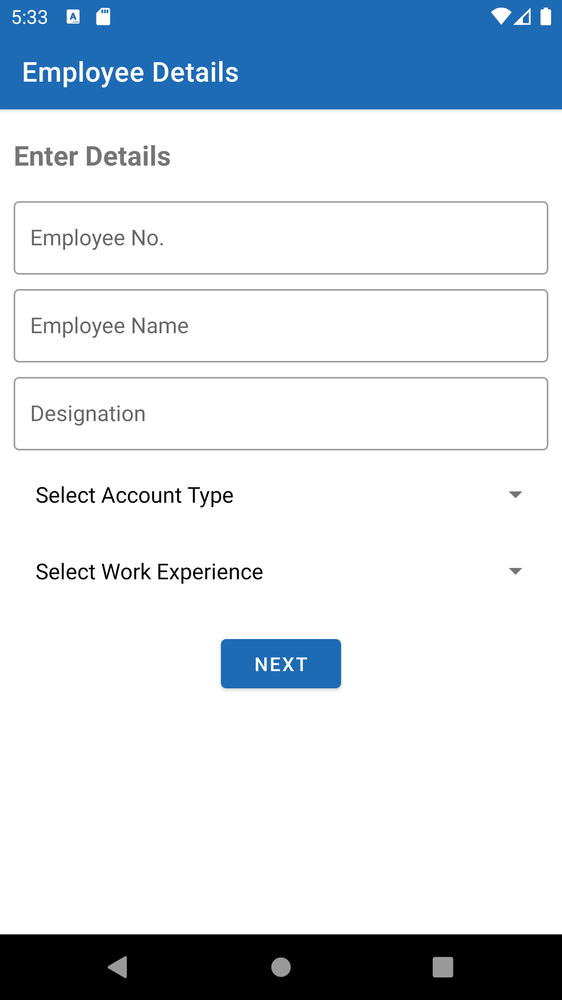
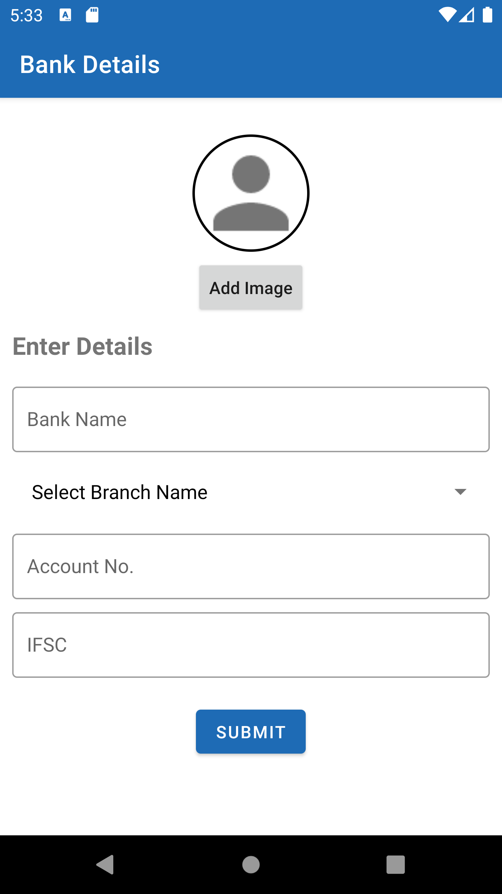

# Recyclerview_SQLite_CRUD
Populating Recyclerview with data from SQLite DB and performing CRUD operations.

#### <b> Technologies used: </b> 
- Material Design 
- Architectural Component - Navigation
- Data Binding

#### <b> Attaching screenshot: </b> 

    
    
  

