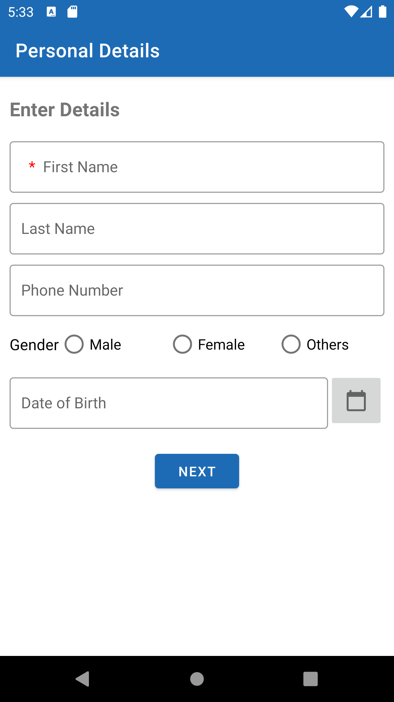

# MyDetails
A sample project that shows the implementation of CRUD Operation using SQLite db and display the data in Recyclerview.

#### <b> Technologies used: </b> 
- Material Design 
- Architectural Component - Navigation
- Data Binding

#### <b> Attaching screenshot: </b> 

    
    
  

